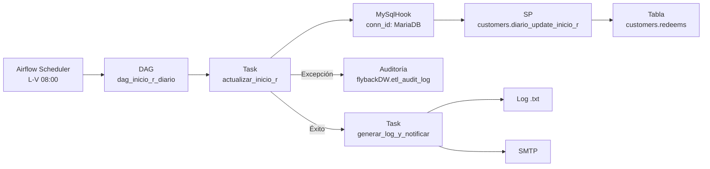
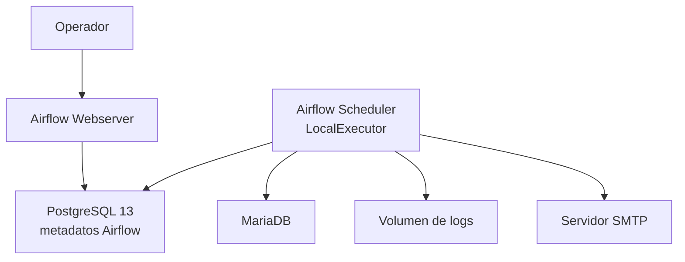
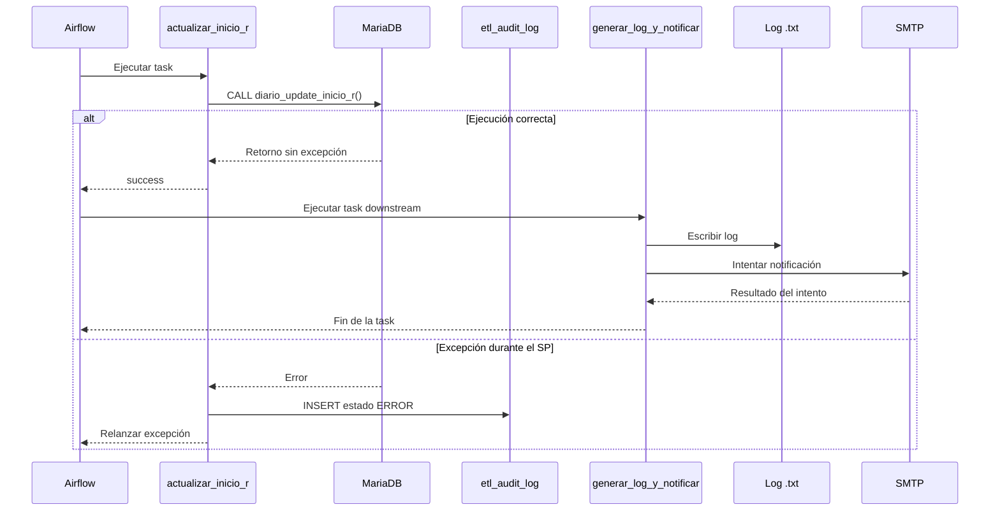

# Especificación Técnica — DAG `dag_inicio_r_diario`

## 1. Control documental

| Campo | Valor |
|---|---|
| Sistema | `flybackDW` — SmartData Redeems |
| Proceso | Actualización diaria de `inicio_r` |
| DAG | `dag_inicio_r_diario` |
| Responsable | Andrés José Sarria Correa |
| Tipo de documento | Technical Specification — BRD + HLD + LLD + Runbook |
| Versión del documento | `v2.0` |
| Última actualización | 2026-07-05 |
| Estado | Vigente |
| Implementación documentada | `dags/etl_flyback/dag_inicio_r_diario.py` |

### 1.1 Propósito del documento

Esta especificación describe el contexto de negocio, la arquitectura, el diseño técnico y la operación de `dag_inicio_r_diario` según el código disponible en el repositorio.

El documento utiliza rutas relativas para conservar portabilidad entre equipos y ambientes. Los valores de credenciales no forman parte de la especificación.

### 1.2 Artefactos relacionados

| Artefacto | Ruta relativa |
|---|---|
| DAG | `dags/etl_flyback/dag_inicio_r_diario.py` |
| SQL de auditoría de errores | `dags/sql/etl_flyback/insert_audit_log_error.sql` |
| Cargador de SQL | `dags/common/sql_loader.py` |
| Escritor de log de texto | `dags/common/audit_logger.py` |
| Notificador por correo | `dags/common/email_notifier.py` |
| Configuración compartida | `dags/common/db_connections.py` |
| Manual general de operaciones | `docs/etl_flyback/MANUAL_OPERACIONES.md` |
| Infraestructura | `docker-compose.yml` y `Dockerfile` |

---

## 2. Contexto de negocio — BRD

### 2.1 Antecedente

La actualización de la columna `inicio_r` se ejecutaba mediante el batch de Navicat `Batch_Diario_Inicio_r`. La operación requería un disparo manual durante los días laborables.

El proceso fue migrado a Airflow para disponer de programación automática, historial de ejecución y notificación operativa.

### 2.2 Objetivo

Ejecutar `customers.diario_update_inicio_r()` de lunes a viernes a las 08:00, registrar errores de ejecución y producir un log de texto con notificación por correo después de una ejecución correcta.

### 2.3 Resultado operativo

| Resultado | Evidencia disponible |
|---|---|
| Ejecución automática | DAG programado mediante cron en Airflow. |
| Ejecución del proceso existente | Llamada al stored procedure de MariaDB. |
| Historial técnico | DAG runs y task instances en Airflow. |
| Registro de errores | Inserción en `flybackDW.etl_audit_log`. |
| Confirmación de éxito | Archivo `.txt` e intento de notificación SMTP. |

### 2.4 Actores

| Actor | Responsabilidad |
|---|---|
| Airflow Scheduler | Crear la ejecución programada del DAG. |
| Data Engineer | Mantener, monitorear y operar el proceso. |
| MariaDB | Ejecutar el SP y persistir sus cambios. |
| PostgreSQL de Airflow | Conservar metadatos de DAGs y tareas. |
| Servicio SMTP | Entregar la notificación informativa. |

### 2.5 Alcance funcional

El DAG realiza las siguientes acciones:

1. Invoca `customers.diario_update_inicio_r()` mediante la conexión Airflow `MariaDB`.
2. Registra en base de datos una excepción generada durante la invocación.
3. Relanza la excepción para que Airflow marque la tarea como fallida.
4. Cuando la actualización termina correctamente, genera un archivo de texto.
5. Intenta enviar por SMTP el contenido del log.

La lógica que calcula y actualiza `inicio_r` pertenece al stored procedure. Su especificación se documentará junto con su definición técnica.

### 2.6 Caso de uso

**Precondiciones**

- Airflow Webserver y Scheduler están disponibles.
- La conexión `MariaDB` está configurada.
- El SP `customers.diario_update_inicio_r()` existe y puede ejecutarse.
- El volumen de logs está disponible para escritura.
- Las variables del servicio de correo están disponibles en el contenedor.

**Disparador programado**

- Cron: `0 8 * * 1-5`.
- Zona horaria del ambiente: `America/Cancun`.

**Flujo principal**

1. Airflow crea el DAG run.
2. `actualizar_inicio_r` ejecuta el SP.
3. La tarea termina en `success` cuando la llamada no genera una excepción.
4. Airflow habilita `generar_log_y_notificar`.
5. La segunda tarea crea el archivo `.txt`.
6. La función de correo intenta enviar la confirmación.

**Postcondición**

- Airflow conserva el estado de ejecución.
- El SP fue invocado una vez por la task instance.
- Si la ruta de éxito se completó, existe un log de texto y se realizó el intento de notificación.

---

## 3. Arquitectura general — HLD

### 3.1 Diagrama de componentes



### 3.2 Topología de ejecución



### 3.3 Componentes

| Componente | Implementación | Responsabilidad |
|---|---|---|
| Orquestador | Apache Airflow 2.9.3 | Programar, ejecutar y registrar estados. |
| Executor | `LocalExecutor` | Ejecutar las tareas del ambiente actual. |
| Metadata database | PostgreSQL 13 | Conservar metadatos de Airflow. |
| Conector de negocio | `MySqlHook` | Resolver la conexión y ejecutar SQL en MariaDB. |
| Operación de negocio | Stored procedure MariaDB | Actualizar la información de `inicio_r`. |
| Auditoría de error | SQL externo | Registrar errores en `etl_audit_log`. |
| Log operativo | Archivo `.txt` | Conservar la confirmación textual de éxito. |
| Notificación | SMTP | Enviar confirmación informativa por correo. |

### 3.4 Flujo de control

```text
actualizar_inicio_r
        |
        | success
        v
generar_log_y_notificar
```

La dependencia utiliza el trigger rule predeterminado `all_success`. La segunda tarea solo se ejecuta cuando la primera termina correctamente.

---

## 4. Estrategia de portabilidad actual — HLD

### 4.1 Principios aplicados

La implementación utiliza las siguientes separaciones:

- Las credenciales se resuelven mediante Airflow Connections o variables de ambiente.
- El DAG utiliza un identificador lógico de conexión: `MariaDB`.
- El SQL de auditoría se encuentra fuera del archivo del DAG.
- El log y el correo se implementan mediante módulos compartidos.
- La ejecución se realiza dentro de una imagen Docker reproducible.
- No se utiliza directamente un SDK de proveedor de nube.

### 4.2 Dependencias de ejecución

| Capacidad | Implementación actual |
|---|---|
| Orquestación | Apache Airflow |
| Ejecución | Docker + `LocalExecutor` |
| Resolución de conexión | `MySqlHook` + Airflow Connection |
| Datos operativos | MariaDB |
| Metadatos | PostgreSQL |
| Persistencia de log | Volumen Docker |
| Notificación | SMTP |

Esta sección describe la portabilidad disponible en la implementación actual; no afirma independencia respecto de Airflow, MariaDB o SMTP.

---

## 5. Diseño detallado — LLD

### 5.1 Configuración del DAG

| Parámetro | Valor |
|---|---|
| `dag_id` | `dag_inicio_r_diario` |
| `description` | Actualiza `inicio_r` mediante `diario_update_inicio_r`. |
| `schedule_interval` | `0 8 * * 1-5` |
| `start_date` | `datetime(2026, 6, 26)` |
| `catchup` | `False` |
| `tags` | `flybackDW`, `redeems`, `mariadb` |
| Tareas | `actualizar_inicio_r`, `generar_log_y_notificar` |
| Reintentos explícitos | No configurados en este DAG |
| Timeout explícito | No configurado en este DAG |

### 5.2 Configuración de la operación

```python
TAREA = {
    "sp"            : "customers.diario_update_inicio_r",
    "vista_origen"  : "customers.redeems",
    "tabla_destino" : "customers.redeems",
    "sleep_seg"     : 0,
}
```

Los valores `vista_origen` y `tabla_destino` se utilizan al construir el registro de auditoría de error. `sleep_seg` está declarado, pero no participa en la ejecución observada.

### 5.3 Tarea `actualizar_inicio_r`

| Elemento | Valor |
|---|---|
| Operator | `PythonOperator` |
| Callable | `partial(ejecutar_sp, TAREA)` |
| Hook | `MySqlHook(mysql_conn_id='MariaDB')` |
| Acción | `CALL customers.diario_update_inicio_r();` |

**Ruta correcta**

1. Crear el Hook usando `MariaDB`.
2. Ejecutar la sentencia `CALL`.
3. Escribir el mensaje `OK` en el log de la tarea.
4. Devolver el control a Airflow sin excepción.

**Ruta de excepción**

1. Capturar la excepción generada por la llamada.
2. Cargar `insert_audit_log_error.sql`.
3. Agregar al SQL el SP, origen, destino y mensaje de error.
4. Limitar el mensaje a 500 caracteres y remover comillas simples.
5. Ejecutar el INSERT de auditoría.
6. Relanzar la excepción.

### 5.4 Tarea `generar_log_y_notificar`

| Elemento | Valor |
|---|---|
| Operator | `PythonOperator` |
| Callable | `generar_log_y_notificar` |
| Dependencia | Se ejecuta después de `actualizar_inicio_r`. |
| Estado enviado | `OK` |

La tarea:

1. Construye un mensaje de inicio, confirmación del SP y fin.
2. Llama `escribir_log_txt`.
3. Obtiene la ruta del archivo generado.
4. Llama `send_etl_notification` con el log.

El módulo de correo captura errores SMTP y devuelve `False`. La función del DAG no utiliza ese valor como excepción; por lo tanto, el resultado del correo se observa en la salida del proceso.

### 5.5 Diagrama de secuencia



### 5.6 SQL de auditoría de error

El archivo `insert_audit_log_error.sql` registra:

| Columna | Contenido |
|---|---|
| `paquete` | Stored procedure ejecutado. |
| `vista_origen` | `customers.redeems`. |
| `tabla_destino` | `customers.redeems`. |
| `tipo_ejecucion` | `HORA`. |
| `estado` | `ERROR`. |
| `mensaje_error` | Mensaje capturado y sanitizado. |
| `fecha_inicio` | `NOW()`. |
| `fecha_fin` | `NOW()`. |

### 5.7 Log de texto

El módulo compartido genera nombres con el siguiente patrón:

```text
etl_{vista}_FB_log_{YYYYMMDDHHMMSS}.txt
```

Para este DAG, el identificador de vista utilizado es `inicio_r_diario`.

### 5.8 Notificación por correo

La función de notificación recibe:

| Parámetro | Valor utilizado |
|---|---|
| `dag_id` | `dag_inicio_r_diario` |
| `status` | `OK` |
| `log_path` | Ruta devuelta por `escribir_log_txt`. |

El contenido del archivo se incorpora al cuerpo del mensaje cuando la ruta existe.

---

## 6. Reglas de negocio y operación

| ID | Regla |
|---|---|
| RN-01 | El DAG automatiza el proceso que se ejecutaba mediante `Batch_Diario_Inicio_r`. |
| RN-02 | La ejecución programada ocurre de lunes a viernes. |
| RN-03 | No se generan ejecuciones históricas automáticas porque `catchup=False`. |
| RN-04 | La segunda tarea depende del éxito de la actualización. |
| RN-05 | El correo se utiliza como confirmación informativa. |

### 6.1 Estados observables

| Situación | Estado o evidencia |
|---|---|
| SP completado | Task `actualizar_inicio_r` en `success`. |
| SP con excepción | Task en `failed` y intento de auditoría `ERROR`. |
| Log creado | Archivo disponible en el volumen de logs. |
| Correo enviado | Mensaje de confirmación en salida del notificador. |
| Error SMTP controlado | Mensaje de error en salida y retorno `False`. |

---

## 7. Seguridad y configuración

### 7.1 Credenciales

- MariaDB se resuelve mediante la Airflow Connection `MariaDB`.
- SMTP obtiene `EMAIL_USER` y `EMAIL_PASSWORD` mediante variables de ambiente.
- PostgreSQL de Airflow utiliza variables del ambiente Docker.
- La especificación no almacena valores de usuario o contraseña.

### 7.2 Accesos requeridos

La identidad configurada en `MariaDB` necesita permisos para:

- Ejecutar `customers.diario_update_inicio_r()`.
- Insertar el registro de error en `flybackDW.etl_audit_log`.

### 7.3 Datos registrados

El mensaje de excepción se limita a 500 caracteres y se remueven comillas simples antes de incorporarlo al SQL de auditoría.

---

## 8. Evidencia de ejecución y rendimiento

### 8.1 Evidencia disponible

Airflow conserva por ejecución:

- `dag_id` y run ID.
- Estado del DAG.
- Estado de cada tarea.
- Hora de inicio y fin.
- Duración.
- Logs generados por las funciones.

MariaDB conserva el registro configurado cuando la llamada al SP genera una excepción y el INSERT de auditoría puede ejecutarse.

### 8.2 Registro de benchmark

Las mediciones de una ejecución pueden incorporarse con esta estructura:

| Fecha | Ambiente | Inicio | Fin | Duración | Filas afectadas | Estado |
|---|---|---|---|---|---:|---|
| — | — | — | — | — | — | — |

La tabla se completa únicamente con evidencia obtenida de Airflow o de la base de datos.

---

## 9. Despliegue

### 9.1 Infraestructura

| Componente | Configuración actual |
|---|---|
| Airflow | Imagen personalizada basada en `apache/airflow:2.9.3` |
| Executor | `LocalExecutor` |
| Metadata database | `postgres:13` |
| Webserver | Servicio Docker Compose |
| Scheduler | Servicio Docker Compose |
| Driver SQL Server disponible | Microsoft ODBC Driver 18 |
| Zona horaria | `America/Cancun` |

### 9.2 Despliegue local

Desde la raíz del repositorio:

```powershell
docker compose build
docker compose up -d
docker compose ps
```

### 9.3 Validación del DAG

```powershell
docker exec airflow_scheduler airflow dags list
docker exec airflow_scheduler airflow dags list-runs -d dag_inicio_r_diario
```

El DAG debe aparecer en la lista sin import errors.

---

## 10. Runbook de operación

### 10.1 Verificación diaria

1. Abrir Airflow y localizar `dag_inicio_r_diario`.
2. Revisar el DAG run correspondiente.
3. Confirmar el estado de `actualizar_inicio_r`.
4. Confirmar el estado de `generar_log_y_notificar`.
5. Revisar el log de texto cuando la segunda tarea terminó correctamente.
6. Utilizar el correo como confirmación adicional.

### 10.2 Consultar ejecuciones desde terminal

```powershell
docker exec airflow_scheduler airflow dags list-runs -d dag_inicio_r_diario
```

### 10.3 Ejecución manual

```powershell
docker exec airflow_scheduler airflow dags trigger dag_inicio_r_diario
```

### 10.4 Atención de un error del SP

1. Revisar el log de `actualizar_inicio_r`.
2. Consultar el registro `ERROR` correspondiente en `etl_audit_log`.
3. Identificar el mensaje de MariaDB.
4. Confirmar conectividad y permisos.
5. Coordinar la corrección con el responsable del SP o de los datos.
6. Registrar la ejecución manual si se decide reintentar.

### 10.5 Correo no recibido

1. Confirmar primero el estado del DAG en Airflow.
2. Verificar la existencia del archivo `.txt`.
3. Revisar la salida de `generar_log_y_notificar`.
4. Verificar la configuración SMTP sin exponer secretos.

La ausencia del correo no sustituye el estado registrado por Airflow.

### 10.6 Log de texto no encontrado

1. Revisar el estado de la segunda tarea.
2. Validar el volumen de logs.
3. Validar permisos y espacio disponible.
4. Confirmar el valor de `LOG_PATH` dentro del contenedor.

### 10.7 Datos para soporte

- DAG ID.
- Run ID.
- Fecha y hora de ejecución.
- Task ID.
- Estado de la tarea.
- Mensaje de error sanitizado.
- Registro de auditoría asociado, cuando exista.
- Acción ejecutada por el operador.

---

## 11. Validación técnica

### 11.1 Validaciones del DAG

| Validación | Resultado esperado |
|---|---|
| Parsing | El DAG carga sin import errors. |
| Identidad | `dag_id=dag_inicio_r_diario`. |
| Programación | `0 8 * * 1-5`. |
| Catchup | `False`. |
| Tareas | Existen dos tasks con los IDs documentados. |
| Dependencia | Actualización antes de notificación. |

### 11.2 Validaciones funcionales

| Escenario | Evidencia esperada |
|---|---|
| Ejecución correcta | Ambas tareas en `success`, log `.txt` creado. |
| Excepción del SP | Primera tarea `failed`, intento de registro `ERROR`. |
| Error al escribir el log | Segunda tarea `failed`. |
| Error SMTP controlado | Mensaje en salida del notificador y retorno `False`. |

La validación de los cambios internos de `customers.redeems` corresponde a la especificación del stored procedure y sus consultas de auditoría.

---

## 12. Trazabilidad

| Requisito | Componente |
|---|---|
| Programación automática | Definición del DAG |
| Ejecución del SP | `ejecutar_sp` + `MySqlHook` |
| Auditoría de excepción | `insert_audit_log_error.sql` |
| Propagación del fallo | `raise` en `ejecutar_sp` |
| Log de éxito | `escribir_log_txt` |
| Correo de éxito | `send_etl_notification` |
| Historial de ejecución | PostgreSQL/Airflow |

---

## 13. Compatibilidad con Word y PDF

Este Markdown es la fuente maestra de la especificación.

Para producir un espejo en Word o PDF:

1. El contenido textual y las tablas se obtienen de este archivo.
2. Los bloques Mermaid se renderizan como SVG o PNG.
3. Las imágenes generadas se insertan manteniendo el mismo orden y título.
4. Se aplica una plantilla visual de cliente sin modificar el contenido técnico.
5. Word y PDF se consideran salidas generadas; las correcciones regresan primero al Markdown.

Los diagramas se conservan como código Mermaid porque son versionables, revisables y reproducibles.

---

## 14. Historial de cambios

| Fecha | Versión | Cambio | Autor |
|---|---|---|---|
| 2026-06-25 | `v1.0` | Creación del DAG a partir del batch de Navicat. | Andrés José Sarria Correa |
| 2026-07-03 | `v1.0-doc` | Documentación operativa inicial. | Andrés José Sarria Correa |
| 2026-07-05 | `v2.0` | Consolidación BRD, HLD, LLD y Runbook como plantilla base en español. | Andrés + Codex |

