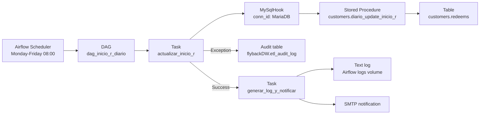
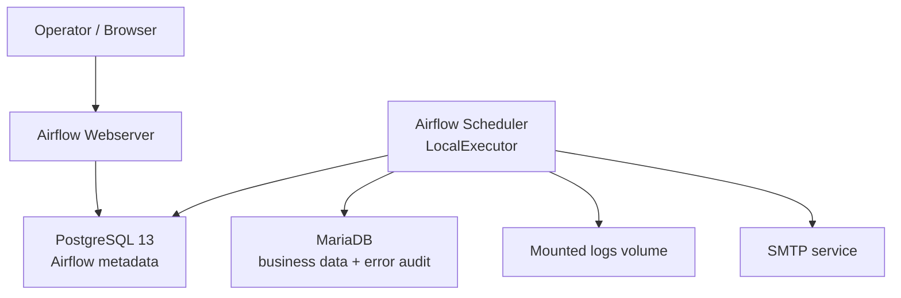
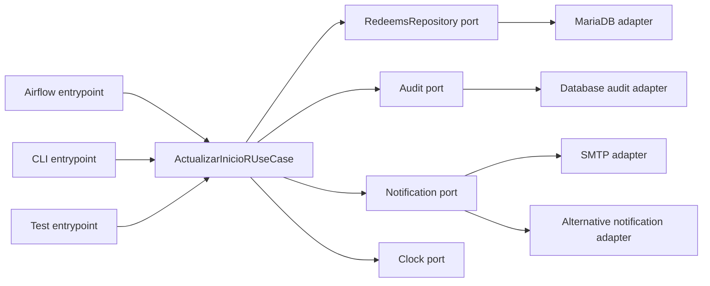
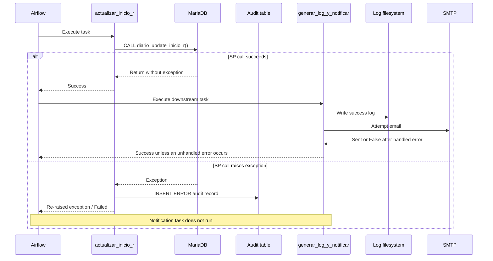

# Technical Specification: `dag_inicio_r_diario`

## 1. Document Control

| Field | Value |
|---|---|
| System | `flybackDW` — SmartData Redeems |
| Pipeline | `dag_inicio_r_diario` |
| Document owner | Andrés José Sarria Correa |
| Technical owner | Data Engineering |
| Document type | BRD Summary + HLD + LLD + Benchmark + Operations Runbook |
| Document version | `v2.0-draft` |
| Last updated | 2026-07-05 |
| Implementation status | Implemented |
| Document status | Draft pending owner validation |
| Source DAG | `dags/etl_flyback/dag_inicio_r_diario.py` |

### 1.1 Purpose of this specification

This document defines the business context, current architecture, detailed implementation, operational behavior, portability constraints and validation requirements of `dag_inicio_r_diario`.

The document distinguishes between:

- **As-Is:** behavior verified in the current repository.
- **To-Be:** proposed improvements that are not yet implemented.
- **TBD:** information that requires measurement or validation.

An item described as To-Be must not be interpreted as current production behavior.

### 1.2 Related artifacts

| Artifact | Repository-relative path |
|---|---|
| DAG implementation | `dags/etl_flyback/dag_inicio_r_diario.py` |
| Error audit SQL | `dags/sql/etl_flyback/insert_audit_log_error.sql` |
| SQL loader | `dags/common/sql_loader.py` |
| Text log writer | `dags/common/audit_logger.py` |
| Email notifier | `dags/common/email_notifier.py` |
| Connection identifiers | `dags/common/db_connections.py` |
| General operations manual | `docs/etl_flyback/MANUAL_OPERACIONES.md` |
| Docker runtime | `docker-compose.yml` and `Dockerfile` |

---

## 2. Business Context — BRD Summary

### 2.1 Problem statement

The update of `customers.redeems.inicio_r` was previously initiated manually through the Navicat batch `Batch_Diario_Inicio_r` at approximately 08:00 on business days.

The manual process created the following operational risks:

- Dependence on a person to initiate the execution.
- Limited centralized execution history.
- Delayed detection of failures.
- Lack of a repeatable operational procedure.

### 2.2 Business objective

Schedule the existing business operation on business days, record execution failures and produce an operational confirmation after successful execution.

### 2.3 Proposed business outcome

| Outcome | Measurement |
|---|---|
| Remove the routine manual trigger | Airflow creates the scheduled run without user intervention. |
| Preserve the existing functional behavior | The same stored procedure is executed. |
| Improve traceability | Airflow run/task history exists; SP failures are written to `etl_audit_log`. |
| Provide operational confirmation | A text log and email are attempted after successful completion of the update task. |

### 2.4 Stakeholders and actors

| Actor | Responsibility |
|---|---|
| Business owner | Confirms the expected meaning of `inicio_r` and business-day rules. |
| Data Engineer | Maintains the DAG, monitors execution and coordinates recovery. |
| Airflow Scheduler | Creates scheduled DAG runs. |
| MariaDB | Executes the stored procedure and persists the affected data. |
| SMTP service | Delivers the optional success notification. |

### 2.5 Scope

Included:

- Scheduling the existing stored procedure.
- Executing it through the configured MariaDB connection.
- Recording a database audit row when the SP task raises an exception.
- Creating a text log after successful execution.
- Attempting an email notification after successful execution.

Excluded:

- Definition or modification of the business logic inside the stored procedure.
- Validation of the stored procedure's internal transaction behavior.
- Automatic correction of source data.
- Weekend and holiday-calendar execution rules beyond the configured weekday cron.
- Guaranteed delivery of email.

### 2.6 Business use case

**Precondition**

- Airflow services are available.
- The Airflow connection `MariaDB` is configured and valid.
- `customers.diario_update_inicio_r()` exists and the connection user can execute it.
- The source table and any objects required by the SP are available.

**Trigger**

- Cron schedule `0 8 * * 1-5`.
- A manual Airflow trigger may also initiate the DAG.

**Main flow**

1. Airflow creates the DAG run.
2. Task `actualizar_inicio_r` calls `customers.diario_update_inicio_r()`.
3. If the task succeeds, task `generar_log_y_notificar` creates a text log.
4. The notification function attempts to send a success email containing the log.
5. Airflow records the resulting task and DAG states.

**Postcondition**

- The SP completed without raising an error at the DAG layer.
- A success text log was created if the second task completed.
- Email delivery was attempted; delivery is not guaranteed by the current implementation.

### 2.7 Business rules

| ID | Rule |
|---|---|
| BR-01 | The DAG replaces the manual trigger of `Batch_Diario_Inicio_r`; it does not redefine the SP business logic. |
| BR-02 | Scheduled execution occurs Monday through Friday. The cron expression does not exclude public holidays. |
| BR-03 | The configured schedule represents the planned start time, not a guaranteed completion time. |
| BR-04 | A successful Airflow task means the SP call returned without an exception; it does not prove the number of rows updated. |
| BR-05 | Email is an informational channel and is not the source of truth for execution state. |

### 2.8 Acceptance criteria

| ID | Criterion | Evidence |
|---|---|---|
| AC-01 | Airflow can parse the DAG without import errors. | DAG parsing test or `airflow dags list`. |
| AC-02 | A scheduled or manual run invokes the configured stored procedure once. | Airflow task log and database evidence. |
| AC-03 | A simulated SP error marks the update task as failed. | Failed task instance. |
| AC-04 | A simulated SP error creates an `ERROR` audit record. | Row in `flybackDW.etl_audit_log`. |
| AC-05 | A successful update task permits the notification task to run. | Task dependency evidence. |
| AC-06 | Re-running the process has a documented and verified outcome. | Idempotency test; currently pending. |

---

## 3. Architecture Overview — HLD

### 3.1 As-Is architecture



### 3.2 Current runtime topology



### 3.3 Component responsibilities

| Component | Current responsibility |
|---|---|
| Airflow Scheduler | Creates the run according to cron and executes tasks using `LocalExecutor`. |
| DAG module | Defines configuration, task callables and task dependency. |
| `MySqlHook` | Resolves the Airflow connection and executes SQL against MariaDB. |
| Stored procedure | Contains the update logic for `inicio_r`. Its implementation is outside this repository. |
| Error audit SQL | Inserts an `ERROR` record after an exception raised by the SP call. |
| Text logger | Writes a timestamped `.txt` file on the shared logs volume. |
| Email notifier | Attempts an authenticated SMTP notification after the success path. |
| PostgreSQL | Stores Airflow metadata, DAG runs and task instances. |

### 3.4 Data flow and control flow

- **Control flow:** Airflow DAG dependency `actualizar_inicio_r >> generar_log_y_notificar`.
- **Business data flow:** The stored procedure reads and updates MariaDB objects, including `customers.redeems`.
- **Audit flow:** Only an exception in `ejecutar_sp` writes the configured error record.
- **Notification flow:** The second task runs only when the first task succeeds under Airflow's default trigger rule.

### 3.5 Current architectural limitations

- Business behavior is implemented in a MariaDB stored procedure not versioned in this repository.
- The DAG callable directly depends on Airflow's `MySqlHook`.
- The notification module contains SMTP-specific implementation details.
- The current design is not independent of the orchestrator or database engine.
- The number of updated rows is not captured.

---

## 4. Cloud-Agnostic Strategy — HLD

### 4.1 Definition

For this project, **cloud-agnostic** means that the core ETL/use-case logic does not know:

- Which cloud provider is used.
- Which scheduler or orchestrator initiates execution.
- How credentials are stored.
- Where operational logs are persisted.
- Which notification provider is selected.

Cloud-agnostic does not automatically mean database-agnostic. SQL dialects, stored procedures and transaction behavior remain database-specific unless they are explicitly abstracted.

### 4.2 Current portability assessment

| Area | Current state | Portability level |
|---|---|---|
| Cloud provider | No cloud SDK is hardcoded. | High |
| Orchestrator | Callable imports Airflow Hook directly. | Low |
| Database engine | Depends on MariaDB and a MariaDB SP. | Low |
| Credentials | Resolved through Airflow Connection. | Medium |
| Logging | Writes to a local/shared filesystem path. | Low |
| Notification | Depends directly on SMTP. | Low |

The current implementation is cloud-neutral at the infrastructure-vendor level, but it is not yet cloud-agnostic at the application boundary.

### 4.3 To-Be ports and adapters



### 4.4 Capability mapping

| Capability | Current adapter | Alternative adapter examples |
|---|---|---|
| Orchestration | Airflow DAG | CLI, managed Airflow, another scheduler |
| Secret resolution | Airflow Connection | Environment injection, external secrets adapter |
| Business data access | MariaDB Hook/SP | Repository adapter for another compatible implementation |
| Log persistence | Mounted filesystem | Object storage adapter or centralized logging sink |
| Notification | SMTP | Queue, webhook or provider-specific notification adapter |

Product names are examples of adapters, not dependencies of the core use case.

### 4.5 Portability acceptance test

The cloud-agnostic objective will be considered demonstrated when:

1. The same use case can run from a CLI without importing Airflow.
2. Airflow invokes that use case through a thin entrypoint.
3. Tests replace database, audit and notification adapters with fakes.
4. Moving execution environments requires configuration or adapter changes, not changes to domain rules.

This is a To-Be objective and is not satisfied by the current DAG.

---

## 5. Detailed Design — LLD

### 5.1 DAG configuration

| Parameter | As-Is value | Notes |
|---|---|---|
| `dag_id` | `dag_inicio_r_diario` | Constant `DAG_ID`. |
| `description` | Updates `inicio_r` through the existing SP. | Defined in the DAG. |
| `schedule_interval` | `0 8 * * 1-5` | Monday-Friday at 08:00 under the configured Airflow timezone. |
| `start_date` | `datetime(2026, 6, 26)` | Naive datetime interpreted using Airflow configuration. |
| `catchup` | `False` | Prevents automatic historical scheduled runs. |
| `tags` | `flybackDW`, `redeems`, `mariadb` | Used for UI classification. |
| Executor | `LocalExecutor` | Configured in Docker Compose. |
| Retries | Airflow/default behavior | No task- or DAG-specific retry count is defined. |
| Retry delay | Airflow/default behavior | No custom delay is defined. |
| Execution timeout | Not configured | To-Be decision. |
| Trigger rule | Default `all_success` | Notification runs only after update success. |

### 5.2 Static task configuration

```text
sp            = customers.diario_update_inicio_r
vista_origen  = customers.redeems
tabla_destino = customers.redeems
sleep_seg     = 0
```

`sleep_seg` exists in the configuration dictionary but is not used by the current implementation.

### 5.3 Task: `actualizar_inicio_r`

| Attribute | Value |
|---|---|
| Operator | `PythonOperator` |
| Callable | `partial(ejecutar_sp, TAREA)` |
| Connection | `MySqlHook(mysql_conn_id='MariaDB')` |
| Command | `CALL customers.diario_update_inicio_r();` |
| Return contract | No structured result |
| Row count | Not collected |

#### Success path

1. Resolve Airflow connection `MariaDB`.
2. Call the configured stored procedure.
3. Print an `OK` message.
4. Complete the task successfully.

#### Failure path

1. Catch the exception.
2. Load `insert_audit_log_error.sql`.
3. Interpolate SP, source, destination and a sanitized/truncated error message.
4. Execute the error audit INSERT through the same hook.
5. Re-raise the original exception.

If the database connection itself is unavailable, both the SP call and the attempt to write the audit row can fail. Airflow task logs remain the fallback evidence.

### 5.4 Task: `generar_log_y_notificar`

| Attribute | Value |
|---|---|
| Operator | `PythonOperator` |
| Callable | `generar_log_y_notificar` |
| Upstream | `actualizar_inicio_r` |
| Trigger rule | Default `all_success` |

Flow:

1. Build a fixed success message.
2. Write a timestamped text file under `LOG_PATH`.
3. Call `send_etl_notification(status='OK')`.

Current limitation: `send_etl_notification` catches SMTP errors and returns `False`. The caller does not inspect the return value. Therefore, an SMTP delivery failure can still leave the Airflow notification task in `success` state.

### 5.5 Sequence diagram



### 5.6 Data contract

The DAG does not transport a dataset between tasks. Its contract is a command against MariaDB.

| Contract element | Value |
|---|---|
| Command | Execute `customers.diario_update_inicio_r()` |
| Primary affected object | `customers.redeems` |
| Primary affected column | `inicio_r` |
| Input grain | Defined internally by the stored procedure; not visible in this repository. |
| Business key | TBD from stored procedure/data model. |
| Output | In-place database update. |
| Updated row count | Not returned to Airflow. |

### 5.7 Transaction and idempotency

| Concern | Verified state |
|---|---|
| SP transaction boundaries | Not available in the inspected repository. |
| Rollback behavior | Not verified. |
| Idempotent re-execution | Not verified. |
| Duplicate side effects | Not verified. |
| Partial update recovery | Not documented in the DAG. |

Before enabling automatic retries or routine manual re-execution, the stored procedure must be reviewed and tested for idempotency and transaction behavior.

### 5.8 Error-handling matrix

| Scenario | As-Is behavior | Evidence | To-Be decision |
|---|---|---|---|
| SP raises an error | Attempt error audit, then fail task. | Airflow log and, when available, audit row. | Retain; add structured error classification. |
| MariaDB unavailable | SP and audit insert may both fail. | Airflow task log. | Add retry policy after idempotency review. |
| No rows require update | SP may return success; row count is unknown. | Airflow success only. | Return and record affected row count if technically possible. |
| Text log write fails | Notification task fails before email. | Airflow task log. | Define log-sink fallback. |
| SMTP authentication/send fails | Function returns `False`; task may still succeed. | Container log only. | Decide whether notification failure should fail, warn or alert separately. |
| Manual re-run | Airflow invokes SP again. | New DAG run. | Verify idempotency before formalizing recovery. |

---

## 6. Non-Functional Requirements and Service Objectives

### 6.1 Scheduling objective

- Planned start: 08:00 `America/Cancun`, Monday-Friday.
- The cron expression excludes weekends but does not implement a business-holiday calendar.

### 6.2 Completion objective

No measured completion SLO was found.

Proposed process:

1. Record representative execution durations.
2. Establish baseline percentiles.
3. Agree a completion deadline with the business owner.
4. Configure alerting against that deadline.

Until this is completed, the documentation must not claim that an 08:00 completion SLA is guaranteed.

### 6.3 Recovery objectives

| Objective | Current value |
|---|---|
| RTO | TBD with business owner. |
| RPO | TBD; operation updates existing MariaDB data. |
| Automatic retries | Not configured in this DAG. |
| Backfill | Disabled through `catchup=False`. |
| Manual recovery | Available through manual DAG trigger, subject to idempotency validation. |

### 6.4 Security requirements

- Credentials must be supplied through Airflow Connections or an external secrets adapter.
- No credential value may appear in DAG code, SQL, documentation or logs.
- Error messages must be reviewed to avoid recording sensitive values.
- SMTP transport security must be assessed; the current notifier authenticates without explicitly enabling TLS.
- Database privileges should be limited to the required SP execution and audit operations.

### 6.5 Observability requirements

Minimum expected signals:

- DAG run state.
- Task instance state.
- Start time, end time and duration.
- SP success or exception.
- Error audit record when the database is reachable.
- Notification attempt status.
- Updated row count, when the SP contract is enhanced.

---

## 7. Performance Benchmarks

### 7.1 Current status

No reproducible performance benchmark was found for this DAG. The cron schedule is not a performance measurement.

### 7.2 Benchmark protocol

Each benchmark must record:

| Field | Required value |
|---|---|
| Test date | Timestamp and timezone |
| Code version | Git commit or release tag |
| Environment | Local/dev/test/prod classification |
| Airflow version | Runtime version |
| Database engine/version | MariaDB version |
| Data volume | Candidate rows and affected rows |
| Start/end time | Measured at task and SP level when possible |
| Duration | Total and database execution time |
| Result | Success/failure and row count |
| Resource signals | CPU, memory, connections or DB load when available |

### 7.3 Baseline results

| Metric | Result |
|---|---|
| Candidate rows | TBD |
| Rows updated | TBD |
| Minimum duration | TBD |
| Median duration | TBD |
| p95 duration | TBD |
| Maximum duration | TBD |
| Failure rate | TBD |

The table must be populated with measured evidence before establishing a completion SLO.

---

## 8. Deployment Specification

### 8.1 Current deployment model

- Docker Compose.
- Custom image based on Apache Airflow 2.9.3.
- Airflow Webserver and Scheduler.
- PostgreSQL 13 metadata database.
- `LocalExecutor`.
- Repository DAGs mounted into `/opt/airflow/dags`.
- Logs mounted into `/opt/airflow/logs`.

### 8.2 Required external configuration

| Configuration | Purpose |
|---|---|
| Airflow Connection `MariaDB` | Execute the SP and write error audit. |
| `EMAIL_USER` | SMTP login. |
| `EMAIL_PASSWORD` | SMTP secret. |
| PostgreSQL environment variables | Airflow metadata connection. |
| `America/Cancun` timezone | Schedule interpretation. |

### 8.3 Local deployment commands

From the repository root:

```powershell
docker compose build
docker compose up -d
docker compose ps
```

Verify the DAG is parsed:

```powershell
docker exec airflow_scheduler airflow dags list
```

The Airflow UI is exposed through the port configured in `docker-compose.yml`.

### 8.4 Deployment validation

1. Confirm PostgreSQL health.
2. Confirm Webserver and Scheduler are running.
3. Confirm `dag_inicio_r_diario` appears without import errors.
4. Confirm the `MariaDB` Airflow Connection exists.
5. Confirm the SP exists and permissions are valid.
6. Confirm the logs volume is writable.
7. Confirm SMTP configuration through a non-production test.
8. Execute the acceptance tests in a permitted environment.

### 8.5 Rollback

Application rollback:

- Restore the previous version of the DAG artifact.
- Rebuild/redeploy the Airflow image or mounted DAGs as required.
- Confirm DAG parsing and pause/unpause state.

Data rollback:

- Not defined at the DAG level.
- Depends on stored procedure transaction behavior and database recovery procedures.
- Must not be claimed as available until the SP and database recovery design are reviewed.

---

## 9. Deployment and Operations Runbook

### 9.1 Normal daily verification

For this specific DAG, verification order is:

1. Airflow DAG run and task states.
2. Airflow task logs.
3. Success text log, when the notification task ran.
4. Email as an informational confirmation.
5. `etl_audit_log` when investigating a stored procedure failure.

The general operations manual treats the audit table as a primary source, but this DAG only writes an audit row on errors. Therefore, absence of an audit row does not prove successful execution.

### 9.2 Check recent runs

```powershell
docker exec airflow_scheduler airflow dags list-runs -d dag_inicio_r_diario
```

Expected successful task sequence:

```text
actualizar_inicio_r          success
generar_log_y_notificar     success
```

### 9.3 Manual trigger

```powershell
docker exec airflow_scheduler airflow dags trigger dag_inicio_r_diario
```

Before manual re-execution in a production environment:

1. Determine why the previous run failed.
2. Confirm whether the SP committed partial work.
3. Confirm that re-execution is idempotent for the affected window.
4. Record the operator, reason and run identifier.

### 9.4 Stored procedure failure

1. Inspect the failed Airflow task log.
2. Query the most recent matching `ERROR` audit record.
3. Determine whether the audit insert itself succeeded.
4. Validate database connectivity and permissions.
5. Review the SP/database error with the responsible owner.
6. Re-run only after transaction and idempotency impact are understood.

### 9.5 Missing success email

1. Check Airflow task state first.
2. Check whether the text log exists.
3. Inspect Scheduler/container output for SMTP errors.
4. Validate `EMAIL_USER` and secret injection without printing their values.
5. Treat the email as informational; do not infer ETL failure from a missing message.

Current behavior warning: a handled SMTP error may not mark the Airflow task as failed.

### 9.6 Missing text log

1. Inspect task `generar_log_y_notificar`.
2. Validate the mounted logs volume and permissions.
3. Confirm available disk space.
4. Confirm `LOG_PATH` resolves to the expected container path.

### 9.7 Escalation data

An incident record should include:

- DAG ID.
- DAG run ID.
- Logical date and actual start time.
- Failed task ID.
- Exception category and sanitized message.
- Audit record identifier, if created.
- Whether partial database effects are possible.
- Recovery action and operator.

---

## 10. Testing Strategy

### 10.1 Static and parsing tests

- Import the DAG in an Airflow-compatible environment.
- Assert the DAG ID, schedule, catchup value and task IDs.
- Assert the dependency `actualizar_inicio_r >> generar_log_y_notificar`.

### 10.2 Unit tests — To-Be

- Successful repository/SP adapter call.
- Repository adapter raises an exception.
- Audit adapter receives sanitized error details.
- Notification adapter success and failure.
- CLI and Airflow entrypoints invoke the same use case.

### 10.3 Integration tests

- Execute against an authorized test MariaDB instance.
- Validate expected changes in `customers.redeems` using synthetic/test fixtures.
- Validate error audit behavior.
- Validate the text-log artifact.
- Validate notification behavior without using production recipients.

### 10.4 Idempotency test

1. Capture an authorized test dataset or reproducible fixture.
2. Execute the SP once.
3. Record affected state and metrics.
4. Execute the SP again with the same logical input.
5. Compare results and side effects.
6. Document whether the second execution is a no-op, a safe repeat or an unsafe duplicate.

Retries must not be added until this result is known.

---

## 11. Risks, Assumptions and Technical Debt

| ID | Type | Description | Status / action |
|---|---|---|---|
| R-01 | Risk | SP implementation is outside this repository. | Obtain and review controlled definition/documentation. |
| R-02 | Risk | Idempotency and partial-commit behavior are unknown. | Test before enabling retries. |
| R-03 | Risk | Error audit uses the same database connection domain as the failed operation. | Define fallback audit/alert channel. |
| R-04 | Risk | SMTP failures are converted to `False` and may not fail the task. | Decide required notification semantics. |
| R-05 | Security | SMTP authentication is used without explicit TLS in current module. | Review and remediate transport security. |
| R-06 | Correctness | No affected-row count is captured. | Enhance SP/use-case result contract. |
| R-07 | Operations | No task retry or execution timeout is configured. | Decide after idempotency and benchmark review. |
| R-08 | Portability | DAG callable imports Airflow Hook directly. | Introduce use-case port and adapter. |
| R-09 | Portability | Business logic is tied to a MariaDB SP. | Document as accepted constraint or migrate logic deliberately. |
| R-10 | Maintainability | Legacy `airflow.hooks.mysql_hook` import is used. | Evaluate provider import during controlled refactor. |
| R-11 | Maintainability | `sys.path.insert` is required for imports. | Package shared code and install it in the image. |
| R-12 | Configuration | `sleep_seg` is declared but unused. | Remove or implement with documented purpose. |

### 11.1 Assumptions requiring owner validation

- The SP is still the authoritative implementation of the business update.
- Monday-Friday is the complete calendar rule.
- An 08:00 planned start remains correct.
- Email remains informational rather than a required delivery channel.
- Manual re-execution is permitted only after impact review.

---

## 12. Implementation Improvement Plan — To-Be

The following changes are recommendations, not current behavior:

1. Define a cloud-agnostic `ActualizarInicioRUseCase`.
2. Place Airflow code in a thin entrypoint.
3. Define repository, audit and notification ports.
4. Add CLI execution using the same use case.
5. Return a structured result containing timestamps, status and affected rows.
6. Verify SP idempotency and transaction behavior.
7. Add retries and timeout only after that verification.
8. Make notification outcome observable according to an explicit policy.
9. Enable encrypted SMTP transport or replace the adapter.
10. Add parsing, unit, integration and idempotency tests.
11. Populate the performance benchmark.
12. Approve measurable SLO and recovery objectives.

---

## 13. Definition of Done

This pipeline is considered fully documented when:

- BRD context and business rules are owner-approved.
- As-Is HLD matches deployed behavior.
- LLD matches the current code version.
- Cloud-agnostic limitations and To-Be adapters are explicit.
- Idempotency and transaction behavior are verified.
- Performance baseline is populated.
- Deployment and operations procedures are tested.
- Acceptance evidence is attached or referenced.
- Risks have an owner and disposition.
- The change log identifies document and implementation versions.

The current implementation is operational, but the documentation Definition of Done remains open for the TBD items identified above.

---

## 14. Change Log

| Date | Version | Change | Author |
|---|---|---|---|
| 2026-06-25 | `v1.0` | Initial DAG created from Navicat batch migration. | Andrés José Sarria Correa |
| 2026-07-03 | `v1.0-doc` | Initial operational documentation. | Andrés José Sarria Correa |
| 2026-07-05 | `v2.0-draft` | Reorganized as BRD/HLD/LLD, added verified As-Is architecture, cloud-agnostic assessment, benchmark protocol, runbook, testing and risks. | Andrés + Codex |

---

## 15. Approval

| Role | Name | Decision | Date |
|---|---|---|---|
| Document owner | Andrés José Sarria Correa | Pending | — |
| Business owner | TBD | Pending | — |
| Technical reviewer | TBD | Pending | — |

